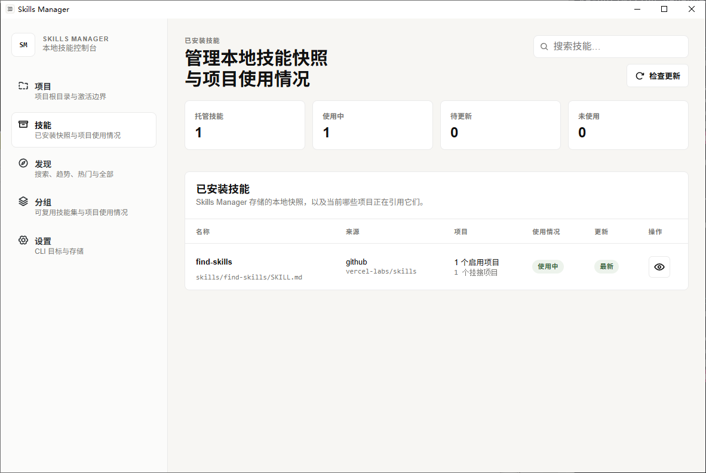

<p align="center">
  
</p>

<h1 align="center">Skills Manager</h1>

<p align="center">
  [<a href="README.md">中文</a>] - [<a href="README.en.md">English</a>]
</p>

<p align="center">
  统一管理所有 Skills，用软链接按项目启用，减少磁盘占用、上下文噪音和 token 消耗。
</p>

<p align="center">
  <a href="#why">Why</a> • <a href="#workflow">Workflow</a> • <a href="#run">Run</a> • <a href="#credits">Credits</a>
</p>

## Why

Skills Manager 把所有 Skills 统一存到本地托管区，再按项目投影到 `.agents/skills`、`.codex/skills` 等目录。

- 一份 Skill 只保存一次
- 项目是唯一激活边界
- 启用时创建 symlink
- 关闭时删除 symlink

## Workflow

推荐先创建一个 `[规划]` 分组，把需求分析、方案设计、任务拆解类 Skills 放进去。

1. 创建 `[规划]` 分组
2. 把规划类 Skills 加入分组
3. 项目启动或进入规划阶段时启用分组
4. Skills Manager 自动软链接到项目目录
5. 规划结束后关闭分组
6. Skills Manager 自动删除这些软链接

这样可以复用同一套规划能力，同时避免规划类 Skills 长期驻留在项目上下文里。

## Stack

- Tauri 2
- React 18
- TypeScript
- Vite
- Rust
- SQLite

## Run

### Requirements

- Node.js 20+
- npm 10+
- Rust stable
- Windows WebView2 Runtime

如果当前终端没有 Cargo 路径：

```powershell
$env:PATH = "$env:USERPROFILE\.cargo\bin;$env:PATH"
```

### Install

```powershell
npm install
```

### Dev

```powershell
npm run tauri dev
```

### Verify

```powershell
npm test
npm run build
cargo test --manifest-path src-tauri/Cargo.toml
cargo check --manifest-path src-tauri/Cargo.toml
```

## Credits

本项目由全 AI 协作开发完成。

感谢 `gpt-5.5`、`gpt-5.4`、`mimo-v2.5-pro`、`claude-sonnet-4-6` 和 `su8.codex`。
